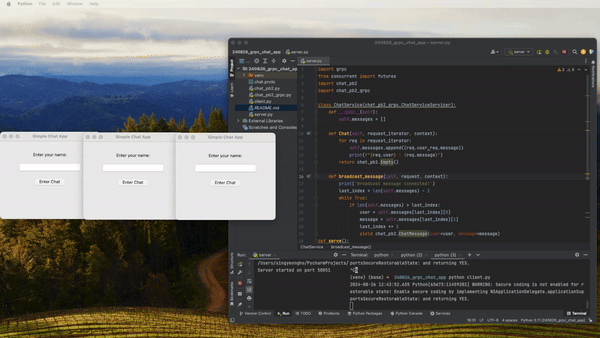
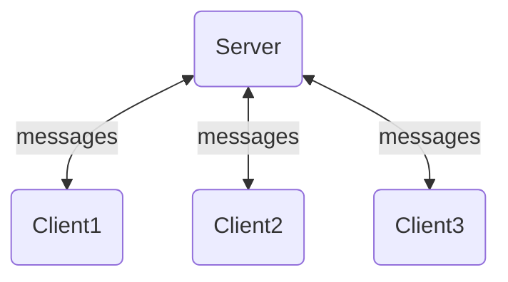

# gRPC & Python을 활용한 간단한 실시간 채팅 어플리케이션

 </img>


최근 API 아키텍쳐 중 뛰어난 성능과 실시간 스트리밍 서비스에 적합한 gRPC 기술에 대해 관심이 생겼는데요.
일단은 gRPC에 대해서 아무것도 아는 지식이 없었기 때문에, 인터넷 검색과 유튜브에서 관련 영상을 찾아보면서 공부하였습니다.
그럼에도 불구하고 구현의 어려움을 느껴 추가적으로 gRPC 유료 강의도 들으면서 이론적인 공부를 진행했습니다.

대부분의 공부가 그렇듯 이론적인 것만 대강 이해하고 넘어가면 힘들여 공부한 지식들은 금방 까먹고 날아가 버리는 것 같습니다.
그래서 공부한 지식을 바탕으로 gRPC를 활용한 미니 프로젝트를 만들어보기로 계획하였습니다.
gRPC 프로젝트로 채팅 어플리케이션을 만들기로 결정하였는데요.
실시간 스트리밍 서비스에서 막강한 힘을 보이는 gRPC의 미니프로젝트로 채팅 어플리케이션을 만들어보는게 적합할 것 같았고
재밌을 것 같아 선택하였습니다.

작성한 proto파일, 파이썬 코드는 모두  공부한 gRPC 이론적인 내용을 바탕으로 Chat gpt와 구글 검색, 유튜브 자료 등을
총 동원하여 구현하였습니다. 하지만 gRPC에 대해서 공부한지 얼마 되지 않았고,
tkinter(GUI 툴킷)라는 파이썬 라이브러리를 처음 사용하여, 코드 상 부족한 부분이 많을 수 있습니다.

본 프로젝트는 gRPC학습에 초점을 둔 프로젝트로 복잡한 기능 없이 코드는 최대한 간단하게 구현하였습니다. 


## Flow

해당 앱은 한 클라이언트가 메시지를 전송했을 때, 서버에서 Stream 타입으로 메시지를 전달 받습니다.
그리고 서버는 다시 모든 클라이언트에게 해당 메시지를 Stream타입으로 전달합니다.

클라이언트측은 Threading을 통해 비동기적으로 서버로 부터 Stream타입의 데이터를 실시간으로 받도록 구현하였습니다.

아래는 chat.proto 파일내 코드인데요. gRPC 서비스 정의 부분을 보면 클라이언트 스트리밍과 서버 스트리밍 각각 한개씩 정의한 것을 확인할 수 있습니다. 
```protobuf
syntax = "proto3";
package chat;

// 비어있는 메시지 정의
message Empty {}

// 메시지 구조 정의
message ChatMessage {
    string user = 1;    // 사용자 이름
    string message = 2; // 전송할 메시지
}

// gRPC 서비스 정의
service ChatService {
    rpc Chat(stream ChatMessage) returns (Empty); // 클라이언트 측 스트리밍
    rpc broadcast_message(Empty) returns (stream ChatMessage); // 서버 측 스트리밍
}
```


## Set-up
### 1. 가상환경 만들기
먼저 gRPC 패키지 버전을 설치할 가상환경을 아래 명령을 참고하여 만들어 활성화시켜 줍니다.
- 가상환경 생성 명령어
```commandline
python -m venv myvenv
```

- 가상환경 활성화 명령어
```commandline
source myvenv/bin/activate
```

### 2. grpcio grpcio-tools 설치하기
가상환경을 활성화한 후 gRPC 사용을 위한 필수 패키지를 아래 명령을 참고하여 설치합니다.

```commandline
pip install grpcio grpcio-tools
```

### 3. proto파일 만들기
gRPC 서비스를 위한 코드를 생성해야 하므로 아래 명령어를 참고하여 코드를 자동생성합니다.
아래 명령을 실행하고나면, 현재 디렉토리에 protobuf 메시지 정의에 대한 파일인 **chat_pb2.py**파일과
gRPC 서비스에 해당하는 **chat_pb2_grpc.py**파일이 생성된것을 확인할 수 있습니다.

- proto파일 컴파일 명령어
```commandline
python -m grpc_tools.protoc -I. --python_out=. --grpc_python_out=. chat.proto
```


### 4. 서버 가동 및 클라이언트 접속
마지막으로 server.py 파일을 run하면 server가 오픈되고,
client.py 파일에서 클라이언트를 run하여 채팅앱의 GUI가 오픈되어 서비스를 시작할 수 있습니다. 